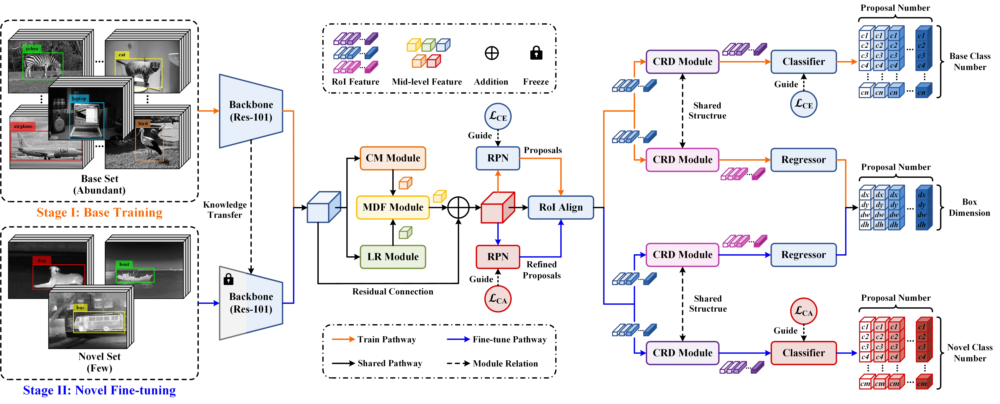

# GLMD-CA
This repo contains the official PyTorch implementation for our paper "Infrared Few-Shot Object Detection via Global-Local Mutual Distillation Network and Confusion-Aware Loss"

<div align="center"></div>

## Abstract
Infrared few-shot object detection (IFSOD) tackles the crucial problem of detecting novel objects with limited annotated samples in the field of thermal imaging. However, beyond the fundamental challenges in few-shot object detection, we also have to overcome the degradation in feature discriminability caused by inherent limitations of infrared imagery. To this end, we propose an IFSOD method based on global-local mutual distillation network and confusion-aware loss (GLMD-CA). First, a novel neck network, termed global-local mutual distillation (GLMD), is designed with four key components: 1) a context modeling module for global dependency capture, 2) a local refinement module for detail enhancement, 3) a mutual distillation fusion module for global-local information integration, and 4) a classification-regression decoupling module for task-specific feature learning, which together improve the overall feature representation. In addition, to mitigate the classification confusion induced by sparse annotations, we introduce the confusion-aware (CA) loss to replace the conventional cross-entropy loss for classifier optimization, effectively suppressing misleading gradients from confusion samples. Finally, we construct a dataset, named IFSODD, for performance evaluation, which comprises 11 categories and over 1,200 images. Experimental results on IFSODD demonstrate that GLMD-CA outperforms other state-of-the-art detectors, achieving an nAP of 47.5 (+2.4), nAP50 of 69.3 (+0.9), and nAP75 of 54 (+4.2) under the 10-shot setting.

## Updates!!
* 【2025/08/22】 We release the official PyTorch implementation of [GLMD-CA](https://github.com/MinjieWan/GLMD-CA).

## Quick Start
**1. Check Requirements**
* Linux with Python == 3.7
* torch == 1.7.1 & torchvision that matches the PyTorch version.
* CUDA 11.0
* GCC >= 4.9

**2. Build GLMD-CA**
* Clone Code
  ```angular2html
  git clone https://github.com/MinjieWan/GLMD-CA.git
  cd GLMD-CA
  ```

* Create a virtual environment (optional)
  ```angular2html
  conda create -n GLMD-CA python=3.7
  ```
* Install PyTorch 1.7.1 with CUDA 11.0

Pytorch versions 1.X.X higher than 1.7.1 should also work. 
  ```shell
  pip install torch==1.7.1+cu110 torchvision==0.8.2+cu110 torchaudio==0.7.2 -f https://download.pytorch.org/whl/torch_stable.html
  ```
